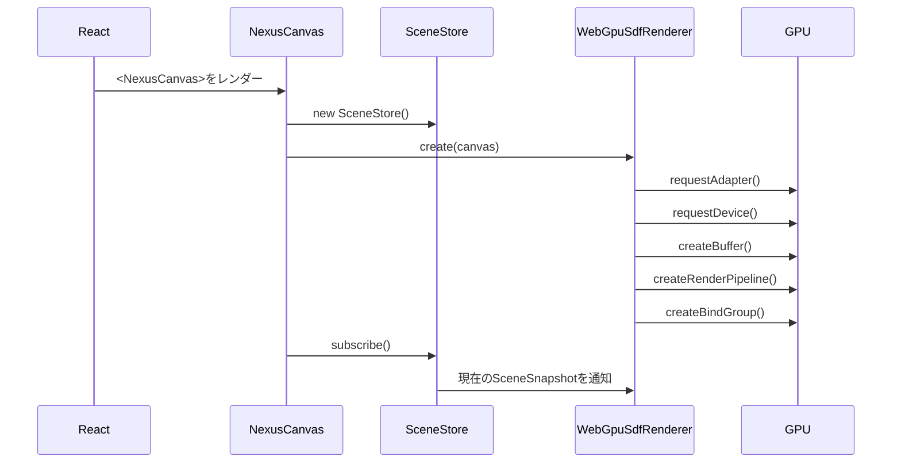
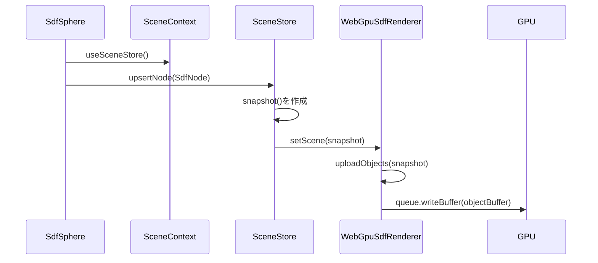
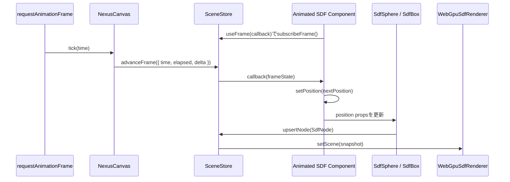
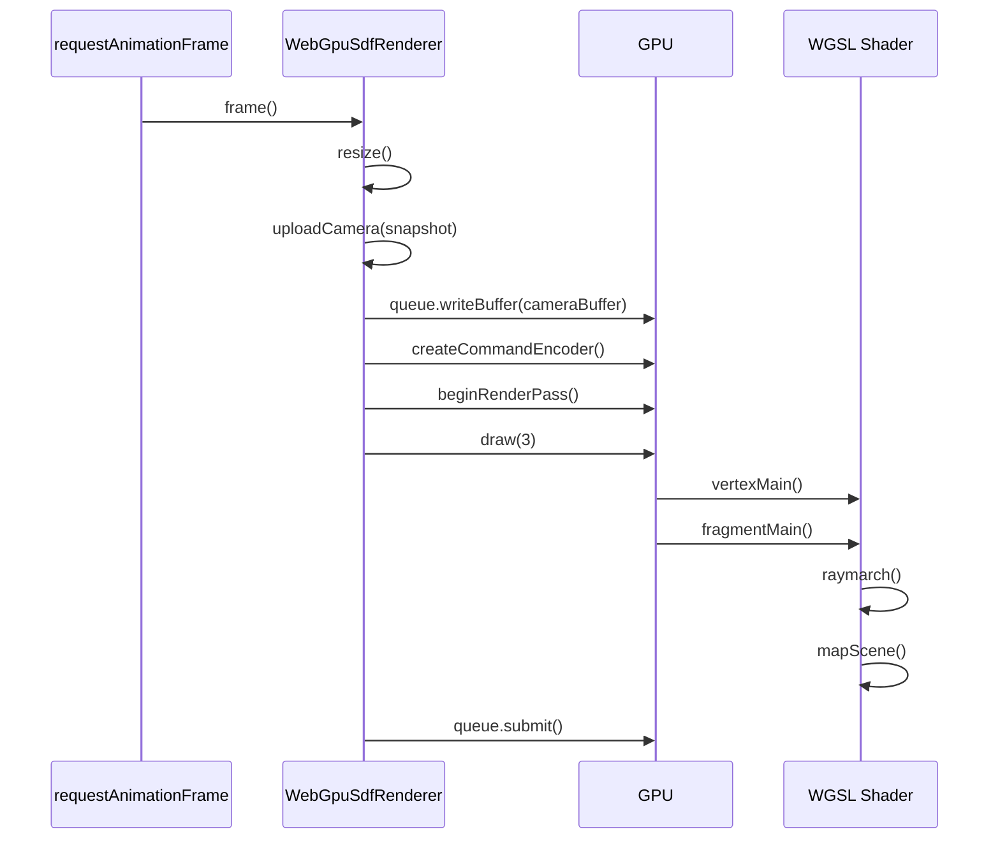

# NexusGPU 構成と処理フロー

このドキュメントは、現在のNexusGPU実装の全体構成と、Reactで宣言したSDFプリミティブがWebGPUで描画されるまでの流れを説明します。

## 目的

現在の実装は、ロードマップのフェーズ1に相当します。

- ReactコンポーネントでSDFシーンを宣言する
- 宣言されたpropsをGPU向けの固定長データへ正規化する
- WebGPUのStorage BufferとUniform Bufferへ同期する
- WGSLのFragment ShaderでSDFレイマーチングを行う

まだ専用の`react-reconciler`は使っていません。まずはAPIとGPUデータ構造を固めるため、React ContextとEffectでプリミティブ登録を行う構成にしています。

## ディレクトリ構成

```text
src/
  App.tsx                    デモアプリとデバッグUI
  main.tsx                   Reactエントリポイント
  styles.css                 画面レイアウトとデバッグUIのスタイル
  nexusgpu/
    index.ts                 公開APIの再エクスポート
    types.ts                 React props、シーン、レンダリング設定の型定義
    NexusCanvas.tsx          ReactツリーとWebGPUレンダラの接続点
    SceneContext.ts          プリミティブとuseFrameがSceneStoreへアクセスするContext
    SceneStore.ts            React側シーン状態とフレーム購読の保持、変更通知
    primitives.tsx           SdfSphere / SdfBox コンポーネント
    WebGpuSdfRenderer.ts     WebGPU初期化、バッファ更新、描画ループ
    sdfShader.ts             WGSLレイマーチングシェーダ
    math.ts                  Vec3正規化などの小さな補助関数
```

## 主要コンポーネントの責務

### App.tsx

デモシーンとデバッグUIを持つアプリケーション層です。

`resolutionScale`、`maxSteps`、`shadows`などのstateを保持し、`NexusCanvas`の`renderSettings`へ渡します。これにより、UI操作がWebGPUのUniform Bufferへ反映されます。

### NexusCanvas.tsx

React世界とWebGPU世界の接続点です。

主な役割:

- `<canvas>`を生成する
- `SceneStore`を作成してContextで子コンポーネントへ渡す
- `WebGpuSdfRenderer.create(canvas)`でWebGPUレンダラを初期化する
- `SceneStore.subscribe()`でシーン変更を購読する
- 変更された`SceneSnapshot`を`renderer.setScene()`へ渡す
- デバッグ設定を`renderer.setRenderSettings()`へ渡す
- `requestAnimationFrame`でReact側の`useFrame`購読者へ時刻を渡す
- アンマウント時にレンダラと購読を破棄する

### SceneContext.ts

`NexusCanvas`配下のReactコンポーネントが、現在の`SceneStore`へアクセスするためのContextです。

公開API:

- `useSceneStore()`: SDFプリミティブがノード登録に使う内部向けhook
- `useFrame(callback)`: `NexusCanvas`のフレームループを購読する公開hook

`useFrame`のcallbackには`time`、`elapsed`、`delta`が渡されます。SDFオブジェクトを動かす場合は、callback内でReact stateを更新し、そのstateを`<SdfSphere position={...} />`や`<SdfBox position={...} />`へ渡します。

例:

```tsx
function AnimatedSphere() {
  const [position, setPosition] = useState<Vec3>([-1, 0, 0]);

  useFrame(({ elapsed }) => {
    setPosition([-1, Math.sin(elapsed * 1.5) * 0.35, 0]);
  });

  return <SdfSphere position={position} radius={1} />;
}
```

### primitives.tsx

Reactで使うSDFプリミティブを定義します。

現在の公開プリミティブ:

- `<SdfSphere />`
- `<SdfBox />`

各プリミティブはDOMを描画しません。代わりに`useEffect`内で`SdfNode`を作り、`SceneStore.upsertNode()`で登録します。アンマウント時は`SceneStore.removeNode()`で削除します。

### SceneStore.ts

React propsから生成されたシーン状態を保持するストアです。

保持する情報:

- SDFノード一覧
- カメラ設定
- シーンバージョン
- 購読リスナー
- フレーム購読リスナー

`SceneStore`はGPU APIを直接触りません。責務は、React側の変化を`SceneSnapshot`としてレンダラへ通知することです。

`useFrame`用には`subscribeFrame()`と`advanceFrame()`を持ちます。`advanceFrame()`は`NexusCanvas`のフレームループから呼ばれ、登録済みcallbackへ同じ`NexusFrameState`を配信します。

### WebGpuSdfRenderer.ts

WebGPUの低レベル処理を担当します。

主な処理:

- WebGPU Adapter / Deviceの取得
- Canvas Contextの設定
- Uniform BufferとStorage Bufferの作成
- WGSL Shader Moduleの作成
- Render PipelineとBind Groupの作成
- SDFノードのStorage Bufferアップロード
- カメラとデバッグ設定のUniform Bufferアップロード
- `requestAnimationFrame`による描画ループ

ReactやJSXには依存せず、`SceneSnapshot`と`NexusRenderSettings`だけを受け取る設計です。

### sdfShader.ts / shaders

WGSLコードを機能別の文字列パーツとして `src/nexusgpu/shaders` 配下に分け、`sdfShader.ts` で1つのシェーダ文字列へ組み立てます。TypeScript側のUniform/Storage Bufferレイアウトと一致させる必要があるため、バッファレイアウトは `shaderLayout.ts` に集約しています。

シェーダ内の主な関数:

- `vertexMain`: 画面全体を覆う三角形を描画
- `sdSphere`: 球のSDF
- `sdBox`: ボックスのSDF
- `smoothMin`: SDF同士の滑らかな結合
- `mapScene`: 全SDFオブジェクトを評価し、最短距離を返す
- `estimateNormal`: 距離場の勾配から法線を近似
- `raymarch`: レイを進めてSDF表面を探す
- `fragmentMain`: ピクセルごとの最終色を計算

## データ構造

### React側のprops

例:

```tsx
<SdfSphere
  position={[-1.25, 0.1, 0]}
  radius={1.05}
  color={[0.05, 0.74, 0.7]}
  smoothness={0.2}
/>
```

このpropsは`primitives.tsx`で`SdfNode`へ変換されます。

### SdfNode

`SceneStore`が保持する正規化済みデータです。

```ts
type SdfNode = {
  id: symbol;
  kind: "sphere" | "box";
  position: Vec3;
  rotation: Quaternion;
  color: Vec3;
  data: Vec3;
  smoothness: number;
};
```

`data`の意味はプリミティブごとに異なります。

- sphere: `data.x`が半径
- box: `data.xyz`が中心から各面までの半径ベクトル

### GPU側のSdfObject

WGSLでは固定長の構造体として扱います。

```wgsl
struct SdfObject {
  positionKind: vec4<f32>,
  dataSmooth: vec4<f32>,
  color: vec4<f32>,
  rotation: vec4<f32>,
};
```

1オブジェクトは16個の`f32`です。

```text
positionKind = [position.x, position.y, position.z, kind]
dataSmooth   = [data.x, data.y, data.z, smoothness]
color        = [color.r, color.g, color.b, 1]
rotation     = [quaternion.x, quaternion.y, quaternion.z, quaternion.w]
```

`WebGpuSdfRenderer.uploadObjects()`がこのレイアウトへ詰め替えます。

### CameraUniform

カメラ、解像度、デバッグ設定をまとめたUniformです。

```wgsl
struct CameraUniform {
  resolution: vec2<f32>,
  time: f32,
  fov: f32,
  position: vec4<f32>,
  forward: vec4<f32>,
  right: vec4<f32>,
  up: vec4<f32>,
  objectInfo: vec4<f32>,
  renderInfo: vec4<f32>,
};
```

`objectInfo`:

```text
x = objectCount
y = surfaceEpsilon
z = 未使用
w = 未使用
```

`renderInfo`:

```text
x = maxSteps
y = maxDistance
z = shadows enabled: 1 or 0
w = normalEpsilon
```

UniformはWebGPUのアライメント制約が厳しいため、`vec4`境界に揃える設計にしています。

## 初期化フロー



初期化時点では、WebGPUリソースを作ったあとに`SceneStore`の購読を開始します。購読開始時に現在のシーン状態が即座に通知されるため、初回描画に必要なStorage Bufferも更新されます。

## プリミティブ登録フロー



React propsが変わるたびに、対応する`SdfNode`が更新されます。現在は簡潔さを優先し、ノード変更時にオブジェクトバッファ全体を書き直しています。

今後の最適化では、変更されたノードだけをdirty rangeとして部分書き込みする予定です。

## useFrameアニメーションフロー



`useFrame`はSDFプリミティブを直接GPU上で移動させるAPIではありません。React stateやpropsを毎フレーム更新するためのhookです。更新されたpropsは通常のプリミティブ登録フローに入り、`SceneStore`から`WebGpuSdfRenderer`へ同期されます。

## フレーム描画フロー



描画はフルスクリーン三角形を1枚だけ描きます。実際の球や箱の形状は頂点として存在せず、Fragment Shaderが各ピクセルでレイを飛ばしてSDFを評価します。

## レイマーチングの流れ

1. `fragmentMain()`がピクセル座標からカメラレイを作る
2. `raymarch()`がレイ上の現在位置を計算する
3. `mapScene()`が全SDFオブジェクトへの距離を評価する
4. 最短距離ぶんレイを前進させる
5. 距離が`surfaceEpsilon`未満ならヒット扱いにする
6. ヒットしたら`estimateNormal()`で法線を近似する
7. ライティング、リムライト、影を計算して色を返す
8. ヒットしなければ背景色を返す

`maxSteps`と`maxDistance`を小さくすると軽くなりますが、形状が欠けたり遠景が消えたりしやすくなります。

## デバッグ設定の流れ

デバッグUIは`App.tsx`にあります。

```text
App state
  -> NexusCanvas renderSettings
  -> WebGpuSdfRenderer.setRenderSettings()
  -> normalizeRenderSettings()
  -> resize() / uploadCamera()
  -> CameraUniform.renderInfo
  -> WGSL raymarch()
```

各設定の役割:

| 設定 | 反映先 | 効果 |
| --- | --- | --- |
| `resolutionScale` | Canvas内部解像度 | ピクセル数を減らしてGPU負荷を下げる |
| `maxSteps` | `renderInfo.x` | 1ピクセルあたりの最大探索回数 |
| `maxDistance` | `renderInfo.y` | レイが探索する最大距離 |
| `shadows` | `renderInfo.z` | 影用の追加レイマーチを有効化 |
| `normalEpsilon` | `renderInfo.w` | 法線近似の細かさ |
| `surfaceEpsilon` | `objectInfo.y` | 表面ヒット判定のしきい値 |

重い場合は、まず`resolutionScale`を下げ、次に`maxSteps`を下げます。`shadows`は追加のレイマーチを発生させるため、デバッグ中はOFFが基本です。

## 現在の制約

- SDFプリミティブはsphereとboxのみ
- オブジェクト数上限は`MAX_SDF_OBJECTS = 128`
- Storage Bufferは変更時に全体再アップロード
- BVHや空間分割は未実装
- Compute Shaderはまだ未使用
- 専用`react-reconciler`は未実装
- 3DGS統合は未実装

## 今後の拡張方針

1. `react-reconciler`を導入し、Reactツリーの差分をより直接的にSceneStoreへ反映する
2. `SceneStore`にdirty管理を追加し、Storage Bufferの部分更新を行う
3. Compute ShaderでBVHまたはグリッド加速構造を構築する
4. SDFプリミティブを増やす
5. マテリアル、ブレンド演算、CSG演算を型として表現する
6. デバッグビューで距離場、法線、ステップ数、ヒット距離を可視化する
7. 3DGS用のソートと合成パスを追加する
