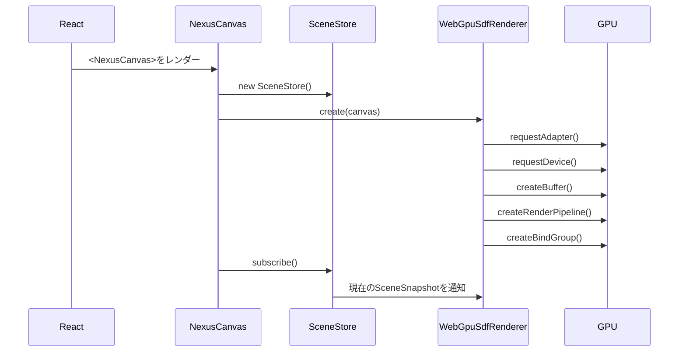
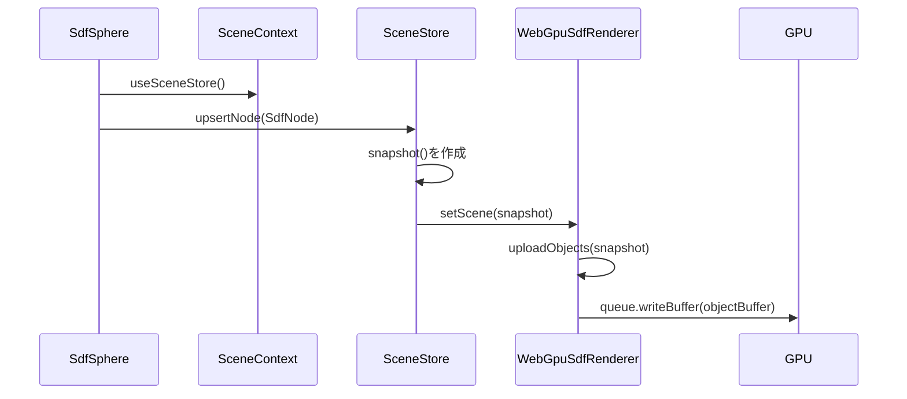
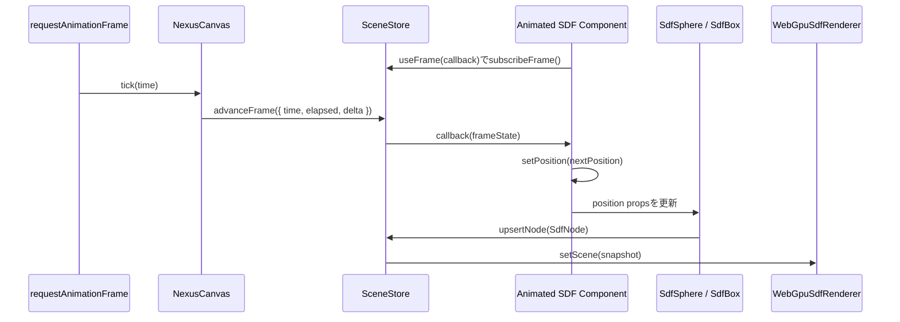
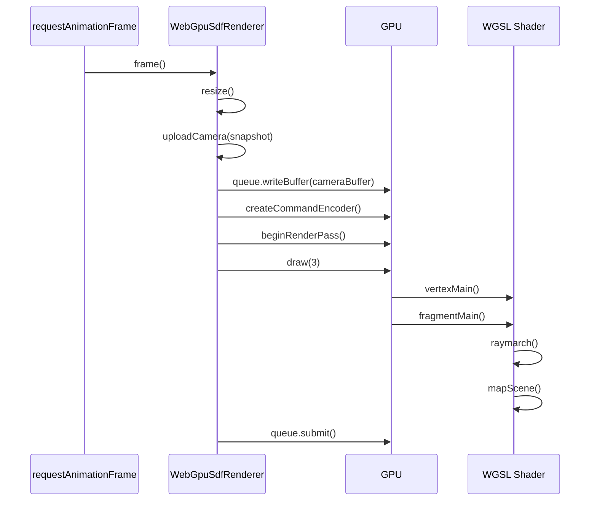

# NexusGPU 構成と処理フロー

このドキュメントは、現在のNexusGPU実装の全体構成と、Reactで宣言したSDFプリミティブがWebGPUで描画されるまでの流れを説明します。

## 目的

現在の実装は、ロードマップのフェーズ1に相当します。

- ReactコンポーネントでSDFシーンを宣言する
- 宣言されたpropsをGPU向けの固定長データへ正規化する
- WebGPUのStorage BufferとUniform Bufferへ同期する
- WGSLのFragment ShaderでSDFレイマーチングを行う

まだ専用の`react-reconciler`は使っていません。まずはAPIとGPUデータ構造を固めるため、React ContextとEffectでプリミティブ登録を行う構成にしています。

## ディレクトリ構成

```text
src/
  App.tsx                    デモアプリの画面構成と状態の配線
  main.tsx                   Reactエントリポイント
  styles.css                 画面レイアウトとデバッグUIのスタイル
  app/
    renderSettings.ts        デモアプリ用レンダリング設定の初期値
    useFullscreenViewport.ts フルスクリーン表示とviewport高さ同期のhook
  panels/
    SceneParametersPanel.tsx シーン固有パラメータの操作UI
    RenderSettingsPanel.tsx  レンダリング品質を調整するデバッグUI
  scenes/
    AnimatedSdfScene.tsx     デモ用SDFシーン、scene camera / lighting、アニメーション実装
  nexusgpu/
    index.ts                 公開APIの再エクスポート
    types.ts                 React props、シーン、レンダリング設定の型定義
    defaults.ts              NexusCanvas / SceneStoreが使うライブラリ側fallback値
    NexusCanvas.tsx          ReactツリーとWebGPUレンダラの接続点
    SceneContext.ts          プリミティブとuseFrameがSceneStoreへアクセスするContext
    SceneStore.ts            React側シーン状態とフレーム購読の保持、変更通知
    primitives.tsx           SdfSphere / SdfBox コンポーネント
    WebGpuSdfRenderer.ts     WebGPU初期化、バッファ更新、描画ループ
    sdfShader.ts             WGSL文字列のエントリポイント
    math.ts                  Vec3正規化などの小さな補助関数
    shaders/
      index.ts               WGSLセクションの結合
      shaderConstants.ts     MAX_OBJECTS / MAX_STEPS_CAP の生成
      shaderLayout.ts        Uniform / Storage Buffer / SceneHit のWGSL定義
      vertexShader.ts        フルスクリーン三角形のvertex shader
      sdfPrimitivesShader.ts SDFプリミティブと補助関数
      sceneMappingShader.ts  Storage Buffer上のSDFオブジェクト走査
      raymarchShader.ts      レイマーチング本体
      lightingShader.ts      法線推定と背景色
      fragmentShader.ts      カメラレイ生成、ライティング、最終色
```

## 主要コンポーネントの責務

### App.tsx

デモアプリの画面構成と状態の配線を担当するアプリケーション層です。

`renderSettings`とシーン固有パラメータのstateを保持し、`NexusCanvas`、`AnimatedSdfScene`、各パネルへ渡します。`App.tsx`自体にはシーンのプリミティブ定義、scene camera / lighting、フルスクリーン制御の詳細を置かず、画面全体の組み立てに寄せています。

主な接続:

- `useFullscreenViewport()`で`main`要素のref、フルスクリーン状態、表示高さ用style、切り替え関数を受け取る
- `INITIAL_RENDER_SETTINGS`を初期値として`renderSettings`を保持する
- `renderSettings`を`NexusCanvas`と`RenderSettingsPanel`へ渡す
- `SCENE_CAMERA`と`SCENE_LIGHTING`を選択中のsceneから受け取り、`NexusCanvas`へ渡す
- `sphereSmoothness`を`AnimatedSdfScene`と`SceneParametersPanel`へ渡す

### app/renderSettings.ts

デモアプリで使う初期レンダリング設定を定義します。

`resolutionScale`、`maxSteps`、`shadows`などの値は`NexusCanvas`の`renderSettings`へ渡されます。これにより、UI操作がWebGPUのUniform Bufferへ反映されます。

この値はアプリ体験用の初期値です。`NexusCanvas`へ`renderSettings`が渡されなかった場合のライブラリ側fallbackとは別物として扱います。

### app/useFullscreenViewport.ts

アプリシェルのフルスクリーン表示と、モバイルブラウザを含むviewport高さの同期を担当するhookです。

主な役割:

- フルスクリーン対象になる`main`要素のrefを保持する
- `fullscreenchange`で現在のフルスクリーン状態を同期する
- `resize`、`orientationchange`、`visualViewport.resize`で高さを再計算する
- フルスクリーン時にCSSカスタムプロパティ`--fullscreen-height`を渡す

### scenes/AnimatedSdfScene.tsx

デモ用SDFシーンの実装です。

薄い床の`SdfBox`と、複数の`SdfSphere`を配置します。球の周回軌道設定、座標計算、`useFrame`によるアニメーションstateはこのファイルに閉じています。

sceneごとの見え方もこのファイルに寄せています。

- `SCENE_CAMERA`: このsceneを表示するときの初期カメラ
- `SCENE_LIGHTING`: このsceneを表示するときのライト方向

`App.tsx`は選択中のsceneからこれらをimportし、`NexusCanvas`の`camera` / `lighting` propsへ渡します。これにより、sceneを増やす場合も各sceneが自分の推奨視点とライトを持てます。

### panels/SceneParametersPanel.tsx / RenderSettingsPanel.tsx

サイドバー上の操作UIです。

`SceneParametersPanel`は`AnimatedSdfScene`に渡すシーン固有パラメータを扱います。現在は`sphereSmoothness`のみを持ちます。

`RenderSettingsPanel`はWebGPUレンダリング品質に関わる共通デバッグ設定を扱います。`resolutionScale`、`maxSteps`、`maxDistance`、`normalEpsilon`、`surfaceEpsilon`、`shadows`を更新します。

### NexusCanvas.tsx

React世界とWebGPU世界の接続点です。

主な役割:

- `<canvas>`を生成する
- `SceneStore`を作成してContextで子コンポーネントへ渡す
- `WebGpuSdfRenderer.create(canvas)`でWebGPUレンダラを初期化する
- `SceneStore.subscribe()`でシーン変更を購読する
- 変更された`SceneSnapshot`を`renderer.setScene()`へ渡す
- `camera` / `lighting` propsを`SceneStore`へ反映する
- デバッグ設定を`renderer.setRenderSettings()`へ渡す
- `requestAnimationFrame`でReact側の`useFrame`購読者へ時刻を渡す
- アンマウント時にレンダラと購読を破棄する

`camera`や`lighting`の一部または全体が省略された場合は、`src/nexusgpu/defaults.ts`のライブラリ側fallback値で補完します。scene固有の初期値は`scenes/*`側から渡す設計です。

### nexusgpu/defaults.ts

`NexusCanvas`や`SceneStore`がprops未指定時に使うライブラリ側fallback値を定義します。

- `DEFAULT_CAMERA`: `camera` propsが省略された場合の基準カメラ
- `DEFAULT_LIGHTING`: `lighting` propsが省略された場合の基準ライト

これらはsceneやアプリの推奨初期値ではなく、ライブラリ単体で安全に動くためのfallbackです。sceneごとに見え方を変える場合は、`SCENE_CAMERA` / `SCENE_LIGHTING`をscene側で定義し、`NexusCanvas`へ明示的に渡します。

### SceneContext.ts

`NexusCanvas`配下のReactコンポーネントが、現在の`SceneStore`へアクセスするためのContextです。

公開API:

- `useSceneStore()`: SDFプリミティブがノード登録に使う内部向けhook
- `useFrame(callback)`: `NexusCanvas`のフレームループを購読する公開hook

`useFrame`のcallbackには`time`、`elapsed`、`delta`が渡されます。SDFオブジェクトを動かす場合は、callback内でReact stateを更新し、そのstateを`<SdfSphere position={...} />`や`<SdfBox position={...} />`へ渡します。

例:

```tsx
function AnimatedSphere() {
  const [position, setPosition] = useState<Vec3>([-1, 0, 0]);

  useFrame(({ elapsed }) => {
    setPosition([-1, Math.sin(elapsed * 1.5) * 0.35, 0]);
  });

  return <SdfSphere position={position} radius={1} />;
}
```

### primitives.tsx

Reactで使うSDFプリミティブを定義します。

現在の公開プリミティブ:

- `<SdfSphere />`
- `<SdfBox />`

各プリミティブはDOMを描画しません。代わりに`useEffect`内で`SdfNode`を作り、`SceneStore.upsertNode()`で登録します。アンマウント時は`SceneStore.removeNode()`で削除します。

### SceneStore.ts

React propsから生成されたシーン状態を保持するストアです。

保持する情報:

- SDFノード一覧
- カメラ設定
- ライティング設定
- シーンバージョン
- 購読リスナー
- フレーム購読リスナー

`SceneStore`はGPU APIを直接触りません。責務は、React側の変化を`SceneSnapshot`としてレンダラへ通知することです。

`useFrame`用には`subscribeFrame()`と`advanceFrame()`を持ちます。`advanceFrame()`は`NexusCanvas`のフレームループから呼ばれ、登録済みcallbackへ同じ`NexusFrameState`を配信します。

### WebGpuSdfRenderer.ts

WebGPUの低レベル処理を担当します。ReactやJSXには依存せず、`SceneSnapshot`と`NexusRenderSettings`だけを受け取る設計です。

主な処理:

- `create(canvas)`でWebGPU Adapter / Deviceを取得する
- `GPUCanvasContext`を取得し、`navigator.gpu.getPreferredCanvasFormat()`でCanvasを設定する
- `CameraUniform`用のUniform Bufferと、`SdfObject`配列用のStorage Bufferを作成する
- `sdfShader`文字列からShader Moduleを作成し、`vertexMain` / `fragmentMain`を使うRender Pipelineを作る
- bind group 0 に camera buffer と object buffer を束ねる
- `ResizeObserver`と毎フレームの`resize()`で、CSSサイズ、`devicePixelRatio`、`resolutionScale`から実描画解像度を決める
- `setScene(snapshot)`で`SceneSnapshot.nodes`を最大`MAX_SDF_OBJECTS`件までStorage Bufferへアップロードする
- `setRenderSettings(settings)`でUI由来の設定を`normalizeRenderSettings()`に通し、シェーダが想定する範囲へ丸める
- 毎フレーム`uploadCamera()`でカメラベクトル、時刻、オブジェクト数、描画設定、ライト方向をUniform Bufferへアップロードする
- フルスクリーン三角形を`draw(3)`し、実際の形状評価はFragment Shaderに任せる
- `destroy()`で`requestAnimationFrame`、`ResizeObserver`、GPU Bufferを解放する

Storage Bufferへの詰め替えは、WGSL側の`SdfObject`と同じ16個の`f32`レコードに合わせています。`kind`は`sphere = 0`、`box = 1`として`positionKind.w`へ格納します。

### sdfShader.ts / shaders

WGSLコードは機能別の文字列パーツとして`src/nexusgpu/shaders`配下に分かれています。`shaders/index.ts`の`assembleSdfShader(maxObjects)`が各セクションを結合し、`sdfShader.ts`が`MAX_SDF_OBJECTS = 128`を渡して最終的な`shaderModule`用文字列を作ります。

結合順:

```text
createShaderConstants(MAX_SDF_OBJECTS)
  -> shaderLayout
  -> vertexShader
  -> sdfPrimitivesShader
  -> sceneMappingShader
  -> raymarchShader
  -> lightingShader
  -> fragmentShader
```

各ファイルの役割:

- `shaderConstants.ts`: `MAX_OBJECTS`と`MAX_STEPS_CAP`をWGSL定数として生成する
- `shaderLayout.ts`: `CameraUniform`、`SdfObject`、`SceneHit`、`@group(0)`のbuffer bindingを定義する
- `vertexShader.ts`: 画面全体を覆う三角形を1枚描く`vertexMain`を定義する
- `sdfPrimitivesShader.ts`: `sdSphere`、`sdBox`、`smoothMin`、`rotateByQuaternion`を定義する
- `sceneMappingShader.ts`: `objects` Storage Bufferを走査し、点から最も近いSDF距離と色を返す`mapScene`を定義する
- `raymarchShader.ts`: `mapScene`を使ってレイを進める`raymarch`を定義する
- `lightingShader.ts`: `estimateNormal`と未ヒット時の`background`を定義する
- `fragmentShader.ts`: ピクセル座標からカメラレイを作り、`raymarch`結果にambient / diffuse / shadow / vignetteを適用して最終色を返す

シェーダ内の主な関数:

- `vertexMain`: 画面全体を覆う三角形を描画
- `sdSphere`: 球のSDF
- `sdBox`: ボックスのSDF
- `smoothMin`: SDF同士の滑らかな結合
- `rotateByQuaternion`: SDFオブジェクトのローカル座標変換
- `mapScene`: 全SDFオブジェクトを評価し、最短距離を返す
- `raymarch`: レイを進めてSDF表面を探す
- `estimateNormal`: 距離場の勾配から法線を近似
- `background`: 未ヒット時の背景色を返す
- `fragmentMain`: ピクセルごとの最終色を計算

## データ構造

### React側のprops

例:

```tsx
<SdfSphere
  position={[-1.25, 0.1, 0]}
  radius={1.05}
  color={[0.05, 0.74, 0.7]}
  smoothness={0.2}
/>
```

このpropsは`primitives.tsx`で`SdfNode`へ変換されます。

### SdfNode

`SceneStore`が保持する正規化済みデータです。

```ts
type SdfNode = {
  id: symbol;
  kind: "sphere" | "box";
  position: Vec3;
  rotation: Quaternion;
  color: Vec3;
  data: Vec3;
  smoothness: number;
};
```

`data`の意味はプリミティブごとに異なります。

- sphere: `data.x`が半径
- box: `data.xyz`が中心から各面までの半径ベクトル

### GPU側のSdfObject

WGSLでは固定長の構造体として扱います。

```wgsl
struct SdfObject {
  positionKind: vec4<f32>,
  dataSmooth: vec4<f32>,
  color: vec4<f32>,
  rotation: vec4<f32>,
};
```

1オブジェクトは16個の`f32`です。

```text
positionKind = [position.x, position.y, position.z, kind]
dataSmooth   = [data.x, data.y, data.z, smoothness]
color        = [color.r, color.g, color.b, 1]
rotation     = [quaternion.x, quaternion.y, quaternion.z, quaternion.w]
```

`WebGpuSdfRenderer.uploadObjects()`がこのレイアウトへ詰め替えます。

### CameraUniform

カメラ、解像度、デバッグ設定をまとめたUniformです。

```wgsl
struct CameraUniform {
  resolution: vec2<f32>,
  time: f32,
  fov: f32,
  position: vec4<f32>,
  forward: vec4<f32>,
  right: vec4<f32>,
  up: vec4<f32>,
  objectInfo: vec4<f32>,
  renderInfo: vec4<f32>,
  lightInfo: vec4<f32>,
};
```

`objectInfo`:

```text
x = objectCount
y = surfaceEpsilon
z = 未使用
w = 未使用
```

`renderInfo`:

```text
x = maxSteps
y = maxDistance
z = shadows enabled: 1 or 0
w = normalEpsilon
```

`lightInfo`:

```text
xyz = directional light direction
w   = 未使用
```

UniformはWebGPUのアライメント制約が厳しいため、`vec4`境界に揃える設計にしています。

## 初期化フロー



初期化時点では、WebGPUリソースを作ったあとに`SceneStore`の購読を開始します。購読開始時に現在のシーン状態が即座に通知されるため、初回描画に必要なStorage Bufferも更新されます。

## プリミティブ登録フロー



React propsが変わるたびに、対応する`SdfNode`が更新されます。現在は簡潔さを優先し、ノード変更時にオブジェクトバッファ全体を書き直しています。

今後の最適化では、変更されたノードだけをdirty rangeとして部分書き込みする予定です。

## useFrameアニメーションフロー



`useFrame`はSDFプリミティブを直接GPU上で移動させるAPIではありません。React stateやpropsを毎フレーム更新するためのhookです。更新されたpropsは通常のプリミティブ登録フローに入り、`SceneStore`から`WebGpuSdfRenderer`へ同期されます。

## フレーム描画フロー



描画はフルスクリーン三角形を1枚だけ描きます。実際の球や箱の形状は頂点として存在せず、Fragment Shaderが各ピクセルでレイを飛ばしてSDFを評価します。

## レイマーチングの流れ

1. `fragmentMain()`がピクセル座標からカメラレイを作る
2. `raymarch()`がレイ上の現在位置を計算する
3. `mapScene()`が全SDFオブジェクトへの距離を評価する
4. 最短距離ぶんレイを前進させる
5. 距離が`surfaceEpsilon`未満ならヒット扱いにする
6. ヒットしたら`estimateNormal()`で法線を近似する
7. ライティング、リムライト、影を計算して色を返す
8. ヒットしなければ背景色を返す

`maxSteps`と`maxDistance`を小さくすると軽くなりますが、形状が欠けたり遠景が消えたりしやすくなります。

## デバッグ設定の流れ

レンダリング品質のデバッグUIは`RenderSettingsPanel.tsx`にあります。stateは`App.tsx`で保持し、パネルから更新された値を`NexusCanvas`へ渡します。

```text
RenderSettingsPanel
  -> App renderSettings state
  -> NexusCanvas renderSettings
  -> WebGpuSdfRenderer.setRenderSettings()
  -> normalizeRenderSettings()
  -> resize() / uploadCamera()
  -> CameraUniform.renderInfo
  -> WGSL raymarch()
```

各設定の役割:

| 設定 | 反映先 | 効果 |
| --- | --- | --- |
| `resolutionScale` | Canvas内部解像度 | ピクセル数を減らしてGPU負荷を下げる |
| `maxSteps` | `renderInfo.x` | 1ピクセルあたりの最大探索回数 |
| `maxDistance` | `renderInfo.y` | レイが探索する最大距離 |
| `shadows` | `renderInfo.z` | 影用の追加レイマーチを有効化 |
| `normalEpsilon` | `renderInfo.w` | 法線近似の細かさ |
| `surfaceEpsilon` | `objectInfo.y` | 表面ヒット判定のしきい値 |

重い場合は、まず`resolutionScale`を下げ、次に`maxSteps`を下げます。`shadows`は追加のレイマーチを発生させるため、デバッグ中はOFFが基本です。

`src/app/renderSettings.ts`の`INITIAL_RENDER_SETTINGS`はデモアプリの初期UI値です。`NexusCanvas`へ`renderSettings`が渡されない場合は、`WebGpuSdfRenderer.ts`内のレンダラ側fallbackが使われます。アプリごとに初期品質を変えたい場合は、アプリ層の初期値だけを変更します。

## 現在の制約

- SDFプリミティブはsphereとboxのみ
- オブジェクト数上限は`MAX_SDF_OBJECTS = 128`
- Storage Bufferは変更時に全体再アップロード
- BVHや空間分割は未実装
- Compute Shaderはまだ未使用
- 専用`react-reconciler`は未実装
- 3DGS統合は未実装

## 今後の拡張方針

1. `react-reconciler`を導入し、Reactツリーの差分をより直接的にSceneStoreへ反映する
2. `SceneStore`にdirty管理を追加し、Storage Bufferの部分更新を行う
3. Compute ShaderでBVHまたはグリッド加速構造を構築する
4. SDFプリミティブを増やす
5. マテリアル、ブレンド演算、CSG演算を型として表現する
6. デバッグビューで距離場、法線、ステップ数、ヒット距離を可視化する
7. 3DGS用のソートと合成パスを追加する
