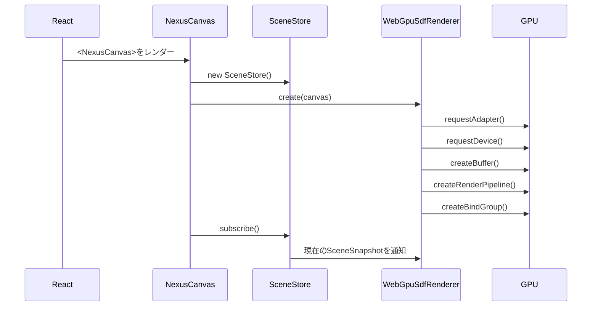
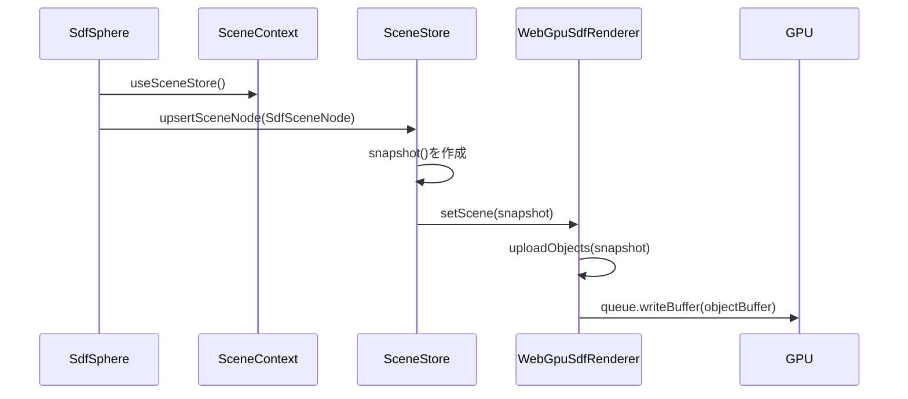
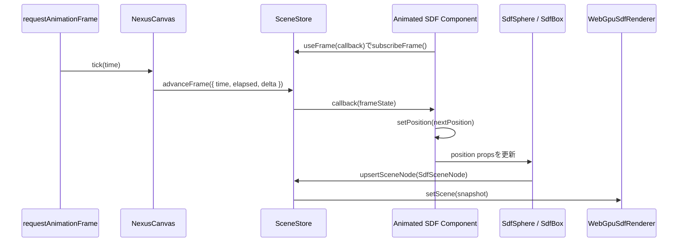
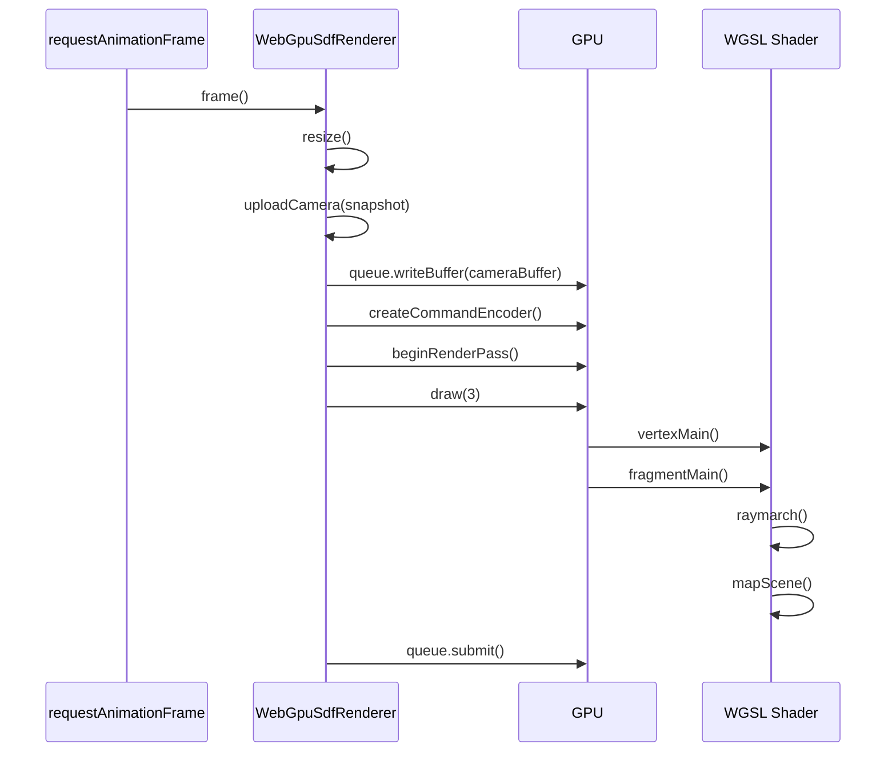

# NexusGPU 構成と処理フロー

このドキュメントは、現在のNexusGPU実装の全体構成と、Reactで宣言したSDFプリミティブがWebGPUで描画されるまでの流れを説明します。

## 目的

現在の実装は、ロードマップのフェーズ1に相当します。

- ReactコンポーネントでSDFシーンを宣言する
- 宣言されたpropsをGPU向けの固定長データへ正規化する
- WebGPUのStorage BufferとUniform Bufferへ同期する
- WGSLのFragment ShaderでSDFレイマーチングを行う

まだ専用の`react-reconciler`は使っていません。まずはAPIとGPUデータ構造を固めるため、React ContextとEffectでプリミティブ登録を行う構成にしています。

## ディレクトリ構成

```text
src/
  App.tsx                    デモアプリの画面構成と状態の配線
  main.tsx                   Reactエントリポイント
  styles.css                 画面レイアウトとデバッグUIのスタイル
  app/
    renderSettings.ts        デモアプリ用レンダリング設定の初期値
    useFullscreenViewport.ts フルスクリーン表示とviewport高さ同期のhook
  panels/
    SceneParametersPanel.tsx registryのparameterControlsからscene固有sliderを描画する汎用UI
    RenderSettingsPanel.tsx  レンダリング品質を調整するデバッグUI
  scenes/
    AnimatedSdfScene2.tsx    デモ用SDFシーンとアニメーション実装
    WaveSdfScene.tsx         SdfFunctionで波面を描くデモシーン
    scenes.json              Appで切り替え可能なscene定義の一覧
    registry.ts              scenes.jsonとscene moduleを接続するresolver
    types.ts                 scene registry用の型定義
  nexusgpu/
    index.ts                 公開APIの再エクスポート
    types.ts                 React props、シーン、レンダリング設定の型定義
    sdfKinds.ts              SDFプリミティブ名とGPU側kind IDの対応表
    defaults.ts              NexusCanvas / SceneStoreが使うライブラリ側fallback値
    NexusCanvas.tsx          ReactツリーとWebGPUレンダラの接続点
    useOrbitCameraControls.ts Canvas上のドラッグ、ホイール、ピンチをカメラ更新へ変換するhook
    SceneContext.ts          プリミティブとuseFrameがSceneStoreへアクセスするContext
    SceneStore.ts            React側シーン状態とフレーム購読の保持、変更通知
    primitives.tsx           SdfSphere / SdfBox / SdfFunction / SdfGroup コンポーネント
    WebGpuSdfRenderer.ts     WebGPU初期化、バッファ更新、描画ループ
    sdfShader.ts             WGSL文字列のエントリポイント
    math.ts                  Vec3正規化などの小さな補助関数
    shaders/
      index.ts               WGSLセクションの結合
      shaderConstants.ts     MAX_OBJECTS / MAX_STEPS_CAP の生成
      shaderLayout.ts        Uniform / Storage Buffer / SceneHit のWGSL定義
      vertexShader.ts        フルスクリーン三角形のvertex shader
      sdfPrimitivesShader.ts SDFプリミティブと補助関数
      sceneMappingShader.ts  SDF評価関数と展開済みmapSceneの生成
      raymarchShader.ts      レイマーチング本体
      lightingShader.ts      法線推定と背景色
      fragmentShader.ts      カメラレイ生成、ライティング、最終色
```

## 主要コンポーネントの責務

### App.tsx

デモアプリの画面構成と状態の配線を担当するアプリケーション層です。

`renderSettings`、選択中scene、シーン固有パラメータのstateを保持し、`NexusCanvas`、選択中scene component、各パネルへ渡します。`App.tsx`自体には個別sceneのimportやプリミティブ定義、scene camera / lightingを置かず、`src/scenes/registry.ts`から選択中のscene定義を受け取ります。

主な接続:

- `useFullscreenViewport()`で`main`要素のref、フルスクリーン状態、表示高さ用style、切り替え関数を受け取る
- `INITIAL_RENDER_SETTINGS`を初期値として`renderSettings`を保持する
- `renderSettings`を`NexusCanvas`と`RenderSettingsPanel`へ渡す
- `NexusCanvas`から受け取る`NexusRenderStats`を保持し、`RenderSettingsPanel`へ渡す
- `SCENES`から選択中のscene定義を取得し、scene selectorを表示する
- 選択中sceneの`camera`と`lighting`を`NexusCanvas`へ渡す
- 選択中sceneの`Component`へ`sceneParameters`を渡す
- 選択中sceneの`parameterControls`、`sceneParameters`、partial update関数を`SceneParametersPanel`へ渡す

sceneを切り替えるときは、`activeSceneId`と`sceneParameters`を同じイベント内で更新します。これにより、新しいsceneのパネルに前のscene用パラメータが一時的に渡ることを避けます。

### scenes/scenes.json / registry.ts / types.ts

`src/scenes/scenes.json`は、アプリで切り替え可能なsceneをまとめる登録ファイルです。`src/scenes/registry.ts`はJSONを読み、`module`に対応するtsxファイルを`import.meta.glob`で解決して`NexusSceneDefinition`へ変換します。`App.tsx`は個別sceneを直接importせず、registryの定義だけを参照します。

各scene定義は`NexusSceneDefinition`として次の情報を持ちます。

- `id`: scene selectorで使う一意なID
- `title`: sidebarに表示するscene名
- `description`: sceneの短い説明
- `module`: `Scene` componentをexportするsceneファイルへの相対パス
- `camera`: そのsceneの推奨カメラ
- `lighting`: そのsceneの推奨ライト
- `initialParameters`: scene固有パラメータの初期値
- `parameterControls`: 任意のscene固有パラメータslider定義
- `Component`: `parameters`を受け取るscene component

sceneを追加する場合、基本的には`Scene` exportを持つscene本体を作り、`scenes.json`へ1件追加します。調整用sliderが必要なら同じ定義に`parameterControls`を追加します。`App.tsx`や`registry.ts`のimport / JSXをsceneごとに書き換える必要はありません。

### app/renderSettings.ts

デモアプリで使う初期レンダリング設定を定義します。

`resolutionScale`、`maxSteps`、`shadows`、`stereoSbs`などの値は`NexusCanvas`の`renderSettings`へ渡されます。これにより、UI操作がWebGPUのUniform Bufferへ反映されます。

この値はアプリ体験用の初期値です。`NexusCanvas`へ`renderSettings`が渡されなかった場合のライブラリ側fallbackとは別物として扱います。

### app/useFullscreenViewport.ts

アプリシェルのフルスクリーン表示と、モバイルブラウザを含むviewport高さの同期を担当するhookです。

主な役割:

- フルスクリーン対象になる`main`要素のrefを保持する
- `fullscreenchange`で現在のフルスクリーン状態を同期する
- `resize`、`orientationchange`、`visualViewport.resize`で高さを再計算する
- フルスクリーン時にCSSカスタムプロパティ`--fullscreen-height`を渡す

### scenes/AnimatedSdfScene2.tsx / scenes/WaveSdfScene.tsx

デモ用SDFシーンの実装です。

`AnimatedSdfScene2.tsx`は、薄い床の`SdfBox`と、複数の`SdfSphere`を配置します。球の周回軌道設定、座標計算、`useFrame`によるアニメーションstateはこのファイルに閉じています。

`WaveSdfScene.tsx`は、`SdfFunction`で波面の高さ場を描くsceneです。波の振幅、周波数、速度はscene固有パラメータとして受け取ります。

sceneごとの見え方は`scenes.json`へ寄せています。

- `camera`: このsceneを表示するときの初期カメラ
- `lighting`: このsceneを表示するときのライト方向

registryは`scenes.json`からこれらを読み、`App.tsx`は選択中のregistry定義を通して`NexusCanvas`の`camera` / `lighting` propsへ渡します。これにより、sceneを増やす場合も各sceneが自分の推奨視点とライトを持てます。

### panels/SceneParametersPanel.tsx / RenderSettingsPanel.tsx

サイドバー上の操作UIです。

`SceneParametersPanel`は、registryの`parameterControls`を元にscene固有パラメータ用sliderを描画します。現在値はsceneの`initialParameters`と同じ形の`parameters`から読み、変更時はpartial update関数へ変更された値だけを渡します。

`RenderSettingsPanel`はWebGPUレンダリング品質に関わる共通デバッグ設定を扱います。`resolutionScale`、`maxSteps`、`maxDistance`、`normalEpsilon`、`surfaceEpsilon`、`shadows`に加え、ステレオSBS表示のON/OFF、`stereoBase`、左右eye反転を更新します。

また、`NexusCanvas`から返される`NexusRenderStats`を表示します。現在は`fps`と、CSSサイズではなくWebGPUへ渡す実描画ピクセル数`canvasPixelSize`を扱います。これらはユーザー入力ではなくレンダラ側の観測値です。

### NexusCanvas.tsx

React世界とWebGPU世界の接続点です。

主な役割:

- `<canvas>`を生成する
- `SceneStore`を作成してContextで子コンポーネントへ渡す
- `WebGpuSdfRenderer.create(canvas)`でWebGPUレンダラを初期化する
- `SceneStore.subscribe()`でシーン変更を購読する
- 変更された`SceneSnapshot`を`renderer.setScene()`へ渡す
- `useOrbitCameraControls()`へ`canvasRef`、`camera`、`orbitControls`、`SceneStore`を渡す
- `lighting` propsを`SceneStore`へ反映する
- デバッグ設定を`renderer.setRenderSettings()`へ渡す
- `renderer`から通知された`NexusRenderStats`を`onRenderStatsChange`で呼び出し側へ返す
- `requestAnimationFrame`でReact側の`useFrame`購読者へ時刻を渡す
- アンマウント時にレンダラと購読を破棄する

`camera`や`lighting`の一部または全体が省略された場合は、`src/nexusgpu/defaults.ts`のライブラリ側fallback値で補完します。scene固有の初期値は`scenes/*`側から渡す設計です。

### useOrbitCameraControls.ts

Canvas上のユーザー入力をorbit cameraの更新へ変換するhookです。`NexusCanvas`本体からカメラ操作のDOMイベント処理を分離し、`NexusCanvas`は描画基盤の配線に集中します。

主な役割:

- `camera` propsをライブラリ側fallback値で補完し、`SceneStore.setCamera()`へ反映する
- `orbitControls`が有効な場合だけCanvasへ入力イベントを登録する
- 1本指またはマウスドラッグをyaw / pitchの回転へ変換する
- wheel操作をカメラ半径のズームへ変換する
- 2本指のPointerEventを追跡し、指同士の距離変化をピンチズームへ変換する
- `pointerup` / `pointercancel`とアンマウント時にcapture、CSS class、event listenerを片付ける

hook内部では`OrbitCameraState`として`target`、`fov`、`radius`、`yaw`、`pitch`を保持します。入力ごとにこの状態から`NexusCamera`の`position`を再計算し、`SceneStore`へ渡します。2本指操作中は回転を止め、ポインター間距離の比率で`radius`だけを更新します。

### nexusgpu/defaults.ts

`NexusCanvas`や`SceneStore`がprops未指定時に使うライブラリ側fallback値を定義します。

- `DEFAULT_CAMERA`: `camera` propsが省略された場合の基準カメラ
- `DEFAULT_LIGHTING`: `lighting` propsが省略された場合の基準ライト

これらはsceneやアプリの推奨初期値ではなく、ライブラリ単体で安全に動くためのfallbackです。sceneごとに見え方を変える場合は、`scenes.json`の`camera` / `lighting`で定義し、`App.tsx`から`NexusCanvas`へ明示的に渡します。

### SceneContext.ts

`NexusCanvas`配下のReactコンポーネントが、現在の`SceneStore`へアクセスするためのContextです。

公開API:

- `useSceneStore()`: SDFプリミティブがノード登録に使う内部向けhook
- `useFrame(callback)`: `NexusCanvas`のフレームループを購読する公開hook

`useFrame`のcallbackには`time`、`elapsed`、`delta`が渡されます。SDFオブジェクトを動かす場合は、callback内でReact stateを更新し、そのstateを`<SdfSphere position={...} />`や`<SdfBox position={...} />`へ渡します。

例:

```tsx
function AnimatedSphere() {
  const [position, setPosition] = useState<Vec3>([-1, 0, 0]);

  useFrame(({ elapsed }) => {
    setPosition([-1, Math.sin(elapsed * 1.5) * 0.35, 0]);
  });

  return <SdfSphere position={position} radius={1} />;
}
```

### primitives.tsx

Reactで使うSDFプリミティブを定義します。

現在の公開プリミティブ:

- `<SdfSphere />`
- `<SdfBox />`
- `<SdfFunction />`
- `<SdfGroup />`
- `<SdfNot />`
- `<SdfSubtract />`

各プリミティブはDOMを描画しません。代わりに`useEffect`内で`SdfNode`を作り、現在の登録先へ`SdfSceneNode`として登録します。通常は`SceneStore`が登録先ですが、`<SdfGroup />`配下ではグループ内の一時registryが登録先になり、子ノードをまとめた`SdfGroupSceneNode`が親の登録先へ渡されます。

`<SdfFunction />`は、WGSLのSDF関数を文字列として渡す汎用プリミティブです。`data0`、`data1`、`data2`は`Vec4`として受け取り、GPU側の`object.data0`、`object.data1`、`object.data2`へそのまま渡されます。渡した関数には、オブジェクトの`position`と`rotation`を適用済みのローカル座標`point`と、`data0-2`が渡されます。

```tsx
<SdfFunction
  sdfFunction="return length(point) - data0.x;"
  data0={[0.8, 0, 0, 0]}
/>
```

`<SdfFunction />`は任意WGSLなので、boundsを自動推定できません。`bounds={{ radius, center }}`を渡すと、グループのbounding sphere計算に使われます。未指定時は`data0.xyz`を半径ヒントとして保守的に扱います。

`<SdfGroup />`は子SDFをCSG/boolean演算の単位としてまとめます。`op`には`"or"`、`"and"`、`"subtract"`、`"not"`を指定できます。`<SdfNot />`と`<SdfSubtract />`は、それぞれ`op="not"`、`op="subtract"`の薄いラッパーです。

```tsx
<SdfGroup op="and">
  <SdfBox position={[0, 1, 0]} size={[2, 2, 2]} />
  <SdfNot>
    <SdfSphere position={[0.4, 1, 0]} radius={0.7} />
  </SdfNot>
</SdfGroup>
```

現在のグループ実装はGPU上でグループ命令列を解釈しません。React側で作られたシーン木を`WebGpuSdfRenderer`がWGSLの`mapScene()`へ展開し、primitiveデータだけをStorage Bufferへ詰めます。これにより、数十オブジェクト規模ではグループ用のループ、stack、動的op分岐を避けられます。

### sdfKinds.ts

React側のSDFプリミティブ名と、GPU buffer / WGSL側で使う`kind` IDの対応表を定義します。

```ts
export const SDF_PRIMITIVE_KIND_IDS = {
  sphere: 0,
  box: 1,
} as const;
```

`sphere`と`box`のような組み込みプリミティブは、この対応表から固定のkind IDを使います。`SdfFunction`は対応表には追加せず、`CUSTOM_SDF_PRIMITIVE_KIND_START`以降のIDを`WebGpuSdfRenderer`がシーン内の関数文字列ごとに動的に割り当てます。

新しい組み込みSDFプリミティブを追加する場合は、まずこの表へ名前とIDを追加し、`CUSTOM_SDF_PRIMITIVE_KIND_START`を組み込みkind IDの最大値 + 1 に更新します。ユーザー定義の一時的なSDFは`SdfFunction`で扱い、専用kindとして固定登録しません。

### SceneStore.ts

React propsから生成されたシーン状態を保持するストアです。

保持する情報:

- rootの`SdfSceneNode`一覧
- 互換・補助用途のフラットなSDFノード一覧
- カメラ設定
- ライティング設定
- シーンバージョン
- 購読リスナー
- フレーム購読リスナー

`SceneStore`はGPU APIを直接触りません。責務は、React側の変化を`SceneSnapshot`としてレンダラへ通知することです。

`upsertNode()`は単体primitive用の互換経路として残っていますが、内部では`SdfNode`を`{ type: "primitive" }`の`SdfSceneNode`へ包んで`upsertSceneNode()`へ渡します。`<SdfGroup />`は子registryで集めた`SdfSceneNode[]`からgroup nodeを作り、同じ`upsertSceneNode()`経路で登録します。

`useFrame`用には`subscribeFrame()`と`advanceFrame()`を持ちます。`advanceFrame()`は`NexusCanvas`のフレームループから呼ばれ、登録済みcallbackへ同じ`NexusFrameState`を配信します。

### WebGpuSdfRenderer.ts

WebGPUの低レベル処理を担当します。ReactやJSXには依存せず、`SceneSnapshot`と`NexusRenderSettings`だけを受け取る設計です。

主な処理:

- `create(canvas)`でWebGPU Adapter / Deviceを取得する
- `GPUCanvasContext`を取得し、`navigator.gpu.getPreferredCanvasFormat()`でCanvasを設定する
- `CameraUniform`用のUniform Bufferと、`SdfObject`配列用のStorage Bufferを作成する
- `assembleSdfShader()`で生成したWGSL文字列からShader Moduleを作成し、`vertexMain` / `fragmentMain`を使うRender Pipelineを作る
- bind group 0 に camera buffer と object buffer を束ねる
- `ResizeObserver`と毎フレームの`resize()`で、CSSサイズ、`devicePixelRatio`、`resolutionScale`から実描画解像度を決め、変化した場合は`NexusRenderStats.canvasPixelSize`として通知する
- requestAnimationFrameの進みからFPSを500msごとに集計し、`NexusRenderStats.fps`として通知する
- `setScene(snapshot)`で`SceneSnapshot.sceneNodes`からprimitiveだけを取り出し、最大`MAX_SDF_OBJECTS`件までStorage Bufferへアップロードする
- `SceneSnapshot.sceneNodes`をWGSLの`mapScene()`へ展開し、グループ構造やboolean演算をshaderコードとして焼き込む
- `SdfFunction`の関数文字列セット、またはシーン木のtopologyが変わった場合は、custom SDF関数と展開済み`mapScene()`を差し込んだShader Module / Render Pipelineを作り直す
- `setRenderSettings(settings)`でUI由来の設定を`normalizeRenderSettings()`に通し、シェーダが想定する範囲へ丸める
- 毎フレーム`uploadCamera()`でカメラベクトル、時刻、オブジェクト数、描画設定、ライト方向、ステレオSBS設定をUniform Bufferへアップロードする
- フルスクリーン三角形を`draw(3)`し、実際の形状評価はFragment Shaderに任せる
- `destroy()`で`requestAnimationFrame`、`ResizeObserver`、GPU Bufferを解放する

ステレオSBSは現在、1枚のcanvasをFragment Shader内で左右半分に分割し、左eye / 右eyeのレイ原点だけを`camera.right`方向へずらして描画します。これはSDFのフルスクリーン三角形パスでは軽量ですが、mesh、post process、WebXRなど複数の描画パスが入る場合は、将来的に`RenderEyeView[]`のようなeye単位のview情報へ分離し、eyeごとにviewportとcamera uniformを切り替える構造へ拡張する想定です。

Storage Bufferへの詰め替えは、WGSL側の`SdfObject`と同じ24個の`f32`レコードに合わせています。組み込みプリミティブの`kind`は`SDF_PRIMITIVE_KIND_IDS`の値として`positionKind.w`へ格納します。`SdfFunction`の場合は、同じ関数文字列ごとに割り当てた動的kind IDを格納します。グループ自体はStorage Bufferへは入りません。`WebGpuSdfRenderer`がシーン木をたどり、primitiveの出現順に`objects[0]`、`objects[1]`のような参照を使う`mapScene()`を生成します。

例として、次のシーン木がある場合:

```tsx
<SdfGroup op="and">
  <SdfGroup op="or">
    <SdfSphere />
    <SdfSphere />
  </SdfGroup>
  <SdfFunction sdfFunction="..." />
</SdfGroup>
```

概念的には次のようなWGSLへ展開されます。

```wgsl
fn mapScene(point: vec3<f32>) -> SceneHit {
  var best = SceneHit(camera.renderInfo.y, vec3<f32>(0.72, 0.82, 0.9));
  let object0 = objects[0u];
  let localPoint1 = rotateByQuaternion(point - object0.positionKind.xyz, vec4<f32>(-object0.rotation.xyz, object0.rotation.w));
  let hit2 = SceneHit(sdSphere(localPoint1, object0.data0.x), object0.colorSmooth.rgb);
  let object3 = objects[1u];
  let localPoint4 = rotateByQuaternion(point - object3.positionKind.xyz, vec4<f32>(-object3.rotation.xyz, object3.rotation.w));
  let hit5 = SceneHit(sdSphere(localPoint4, object3.data0.x), object3.colorSmooth.rgb);
  var groupHit6 = unionHit(hit2, hit5, 0.7);
  let object7 = objects[2u];
  let localPoint8 = rotateByQuaternion(point - object7.positionKind.xyz, vec4<f32>(-object7.rotation.xyz, object7.rotation.w));
  let hit9 = SceneHit(customSdfFunction0(localPoint8, object7.data0, object7.data1, object7.data2), object7.colorSmooth.rgb);
  var groupHit10 = intersectHit(groupHit6, hit9);
  best = unionHit(best, groupHit10, 0.7);
  return best;
}
```

この方式は、オブジェクト数が数十程度のシーンでGPU上の汎用インタプリタ方式より軽くなることを優先した設計です。scene topologyや`SdfFunction`の種類が変わるとpipeline再生成が必要ですが、位置、回転、色、サイズなどprimitiveレコードの値だけが変わる場合はStorage Buffer更新だけで済みます。

### sdfShader.ts / shaders

WGSLコードは機能別の文字列パーツとして`src/nexusgpu/shaders`配下に分かれています。`shaders/index.ts`の`assembleSdfShader(maxObjects, customSdfFunctions, mapSceneBody)`が各セクションを結合し、最終的な`shaderModule`用文字列を作ります。

組み込みプリミティブだけの初期状態では、custom SDF関数なしでShader Moduleを作ります。シーン内に`SdfFunction`が含まれる場合、`WebGpuSdfRenderer`がユニークな`sdfFunction`文字列を集め、`customSdfFunction0`、`customSdfFunction1`のようなWGSL関数名を割り当てて`assembleSdfShader()`へ渡します。同じ関数文字列を複数ノードで使う場合は、同じWGSL関数を共有します。

`mapSceneBody`は`SceneSnapshot.sceneNodes`から生成される展開済みWGSLです。`sceneMappingShader.ts`は`unionHit`、`intersectHit`、`subtractHit`、`notHit`などの共通関数を定義し、その後ろに展開済み`mapScene()`を差し込みます。グループ構造やprimitive種別をGPUでループ/分岐解釈するのではなく、CPU側でWGSLへコンパイルする形です。

各WGSLセクション内では、組み込みチャンクライブラリから`#include <sdf/sphere>`の形式で関数群を取り込めます。includeは`assembleSdfShader()`の最後に再帰的に解決され、未登録チャンクや循環参照は例外として検出されます。組み込みチャンクは`src/nexusgpu/shaders/shaderLibrary.ts`に定義します。

結合順:

```text
createShaderConstants(MAX_SDF_OBJECTS)
  -> shaderLayout
  -> vertexShader
  -> sdfPrimitivesShader
  -> custom SDF function sources
  -> sceneMappingShader
  -> raymarchShader
  -> lightingShader
  -> fragmentShader
```

各ファイルの役割:

- `shaderConstants.ts`: `MAX_OBJECTS`と`MAX_STEPS_CAP`をWGSL定数として生成する
- `shaderLayout.ts`: `CameraUniform`、`SdfObject`、`SceneHit`、`@group(0)`のbuffer bindingを定義する
- `vertexShader.ts`: 画面全体を覆う三角形を1枚描く`vertexMain`を定義する
- `sdfPrimitivesShader.ts`: `sdSphere`、`sdBox`、`smoothMin`、`rotateByQuaternion`を定義する
- `sceneMappingShader.ts`: boolean合成用の補助関数と、展開済み`mapScene()`を含むシーン評価コードを生成する
- `raymarchShader.ts`: `mapScene`を使ってレイを進める`raymarch`を定義する
- `lightingShader.ts`: `estimateNormal`と未ヒット時の`background`を定義する
- `fragmentShader.ts`: ピクセル座標からカメラレイを作り、`raymarch`結果にambient / diffuse / shadow / vignetteを適用して最終色を返す

シェーダ内の主な関数:

- `vertexMain`: 画面全体を覆う三角形を描画
- `sdSphere`: 球のSDF
- `sdBox`: ボックスのSDF
- `customSdfFunctionN`: `SdfFunction`から生成されたユーザー定義SDF
- `smoothMin`: SDF同士の滑らかな結合
- `rotateByQuaternion`: SDFオブジェクトのローカル座標変換
- `mapScene`: 展開済みのシーン木を評価し、最短距離を返す
- `raymarch`: レイを進めてSDF表面を探す
- `estimateNormal`: 距離場の勾配から法線を近似
- `background`: 未ヒット時の背景色を返す
- `fragmentMain`: ピクセルごとの最終色を計算

## データ構造

### React側のprops

例:

```tsx
<SdfSphere
  position={[-1.25, 0.1, 0]}
  radius={1.05}
  color={[0.05, 0.74, 0.7]}
  smoothness={0.2}
/>
```

このpropsは`primitives.tsx`で`SdfNode`へ変換されます。

### SdfNode

`SceneStore`が保持する正規化済みデータです。

```ts
type SdfNode = {
  id: symbol;
  kind: SdfPrimitiveKind;
  position: Vec3;
  rotation: Quaternion;
  color: Vec3;
  data: SdfData;
  smoothness: number;
  bounds: SdfBoundingSphere;
  sdfFunction?: string;
};
```

`SdfPrimitiveKind`は、組み込みkindと`"function"`で構成されます。`data`はWGSL側の`data0`、`data1`、`data2`へ対応する`vec4 * 3`相当の拡張パラメータです。各要素の意味はプリミティブごとに異なります。

- sphere: `data[0].x`が半径
- box: `data[0].xyz`が中心から各面までの半径ベクトル
- function: `data[0]`、`data[1]`、`data[2]`を`sdfFunction`へそのまま渡す

`sdfFunction`は`kind: "function"`のときだけ使います。文字列はWGSL関数全体、または関数body / 式として指定できます。レンダラは内部で関数名を`customSdfFunctionN`へ差し替え、呼び出しシグネチャを次の形に揃えます。

```wgsl
fn customSdfFunctionN(point: vec3<f32>, data0: vec4<f32>, data1: vec4<f32>, data2: vec4<f32>) -> f32
```

`bounds`はグループのbounding sphere計算に使うCPU側メタデータです。現在の展開型`mapScene()`ではboundsによるGPU枝刈りはまだ行っていませんが、グループ木には保持しておき、将来の展開コード内bounds skipや空間分割へ使えるようにしています。

### SdfSceneNode

`SceneStore`は、root要素として`SdfSceneNode`の配列を保持します。単体primitiveは`SdfPrimitiveSceneNode`、`<SdfGroup />`は`SdfGroupSceneNode`として表現されます。

```ts
type SdfPrimitiveSceneNode = {
  type: "primitive";
  node: SdfNode;
  bounds: SdfBoundingSphere;
};

type SdfGroupSceneNode = {
  type: "group";
  op: "or" | "and" | "subtract" | "not";
  smoothness: number;
  children: readonly SdfSceneNode[];
  bounds: SdfBoundingSphere;
};

type SdfSceneNode = SdfPrimitiveSceneNode | SdfGroupSceneNode;
```

`SceneSnapshot`には互換・custom SDF収集用のフラットな`nodes`と、レンダラが`mapScene()`展開に使う`sceneNodes`の両方が含まれます。

```ts
type SceneSnapshot = {
  nodes: readonly SdfNode[];
  sceneNodes: readonly SdfSceneNode[];
  camera: Required<NexusCamera>;
  lighting: Required<NexusLighting>;
  version: number;
};
```

### GPU側のSdfObject

WGSLでは固定長の構造体として扱います。

```wgsl
struct SdfObject {
  positionKind: vec4<f32>,
  data0: vec4<f32>,
  data1: vec4<f32>,
  data2: vec4<f32>,
  colorSmooth: vec4<f32>,
  rotation: vec4<f32>,
};
```

1オブジェクトは24個の`f32`です。

```text
positionKind = [position.x, position.y, position.z, kind]
data0        = [data[0].x, data[0].y, data[0].z, data[0].w]
data1        = [data[1].x, data[1].y, data[1].z, data[1].w]
data2        = [data[2].x, data[2].y, data[2].z, data[2].w]
colorSmooth  = [color.r, color.g, color.b, smoothness]
rotation     = [quaternion.x, quaternion.y, quaternion.z, quaternion.w]
```

`WebGpuSdfRenderer.uploadObjects()`がこのレイアウトへ詰め替えます。`SdfFunction`もGPU側のレコード構造は変えず、`kind`だけを動的kind IDにして、`data0-2`をcustom SDF関数の引数として使います。

### CameraUniform

カメラ、解像度、デバッグ設定をまとめたUniformです。

```wgsl
struct CameraUniform {
  resolution: vec2<f32>,
  time: f32,
  fov: f32,
  position: vec4<f32>,
  forward: vec4<f32>,
  right: vec4<f32>,
  up: vec4<f32>,
  objectInfo: vec4<f32>,
  renderInfo: vec4<f32>,
  lightInfo: vec4<f32>,
  stereoInfo: vec4<f32>,
};
```

`objectInfo`:

```text
x = objectCount
y = surfaceEpsilon
z = 未使用
w = 未使用
```

`renderInfo`:

```text
x = maxSteps
y = maxDistance
z = shadows enabled: 1 or 0
w = normalEpsilon
```

`lightInfo`:

```text
xyz = directional light direction
w   = 未使用
```

`stereoInfo`:

```text
x = stereo SBS enabled: 1 or 0
y = stereoBase
z = swap eyes: 1 or 0
w = 未使用
```

UniformはWebGPUのアライメント制約が厳しいため、`vec4`境界に揃える設計にしています。

## 初期化フロー



初期化時点では、WebGPUリソースを作ったあとに`SceneStore`の購読を開始します。購読開始時に現在のシーン状態が即座に通知されるため、初回描画に必要なStorage Bufferも更新されます。

## プリミティブ登録フロー



React propsが変わるたびに、対応する`SdfSceneNode`が更新されます。`<SdfGroup />`配下では、子primitiveの更新がグループregistryへ入り、group nodeが再作成されて親へ通知されます。現在は簡潔さを優先し、ノード変更時にオブジェクトバッファ全体を書き直しています。

今後の最適化では、変更されたノードだけをdirty rangeとして部分書き込みする予定です。

## useFrameアニメーションフロー



`useFrame`はSDFプリミティブを直接GPU上で移動させるAPIではありません。React stateやpropsを毎フレーム更新するためのhookです。更新されたpropsは通常のプリミティブ登録フローに入り、`SceneStore`から`WebGpuSdfRenderer`へ同期されます。

## フレーム描画フロー



描画はフルスクリーン三角形を1枚だけ描きます。実際の球や箱の形状は頂点として存在せず、Fragment Shaderが各ピクセルでレイを飛ばしてSDFを評価します。

## レイマーチングの流れ

1. `fragmentMain()`がピクセル座標からカメラレイを作る
2. `raymarch()`がレイ上の現在位置を計算する
3. `mapScene()`が展開済みのシーン木に従ってSDF距離を評価する
4. 最短距離ぶんレイを前進させる
5. 距離が`surfaceEpsilon`未満ならヒット扱いにする
6. ヒットしたら`estimateNormal()`で法線を近似する
7. ライティング、リムライト、影を計算して色を返す
8. ヒットしなければ背景色を返す

`maxSteps`と`maxDistance`を小さくすると軽くなりますが、形状が欠けたり遠景が消えたりしやすくなります。

`stereoSbs`が有効な場合、`fragmentMain()`はcanvas全体の`screenUv`から左右どちらのviewportかを判定し、片目ごとのローカルUVへ変換します。左eye / 右eyeは`stereoBase`の半分だけ`camera.right`方向にずらした`rayOrigin`を使います。`stereoSwapEyes`が有効な場合は左右の割り当てを反転し、交差法向けのSBS表示にします。

このSBS実装は通常カメラから左右eyeを疑似生成するプレビュー用です。WebXRでは`XRFrame.getViewerPose(referenceSpace).views`からdevice APIが与えるeyeごとのpose、projection、viewportを受け取り、同じレイ生成の入力を`RenderEyeView`相当の構造から供給する方針です。

## デバッグ設定の流れ

レンダリング品質のデバッグUIは`RenderSettingsPanel.tsx`にあります。stateは`App.tsx`で保持し、パネルから更新された値を`NexusCanvas`へ渡します。

```text
RenderSettingsPanel
  -> App renderSettings state
  -> NexusCanvas renderSettings
  -> WebGpuSdfRenderer.setRenderSettings()
  -> normalizeRenderSettings()
  -> resize() / uploadCamera()
  -> CameraUniform.renderInfo
  -> CameraUniform.stereoInfo
  -> WGSL raymarch()
```

一方、実行時の観測値は逆方向に流れます。`NexusRenderStats`は入力設定ではなく、レンダラが実際に使っている状態をUIへ返すためのtelemetryです。

```text
WebGpuSdfRenderer.resize()
  -> NexusRenderStats.canvasPixelSize
WebGpuSdfRenderer.updateFps()
  -> NexusRenderStats.fps
  -> NexusCanvas onRenderStatsChange
  -> App renderStats state
  -> RenderSettingsPanel
```

`canvasPixelSize`は`canvas.width` / `canvas.height`と同じ実描画ピクセル数です。CSS上の表示サイズではなく、`clientWidth` / `clientHeight`、`devicePixelRatio`、`resolutionScale`を掛け合わせて決まるWebGPU backing storeサイズを表します。FPSは毎フレームのrequestAnimationFrame間隔から算出しますが、React state更新を抑えるため500msごとに集計して通知します。

各設定の役割:

| 設定 | 反映先 | 効果 |
| --- | --- | --- |
| `resolutionScale` | Canvas内部解像度 | ピクセル数を減らしてGPU負荷を下げる |
| `maxSteps` | `renderInfo.x` | 1ピクセルあたりの最大探索回数 |
| `maxDistance` | `renderInfo.y` | レイが探索する最大距離 |
| `shadows` | `renderInfo.z` | 影用の追加レイマーチを有効化 |
| `normalEpsilon` | `renderInfo.w` | 法線近似の細かさ |
| `surfaceEpsilon` | `objectInfo.y` | 表面ヒット判定のしきい値 |
| `stereoSbs` | `stereoInfo.x` | canvasを左右に分割したSBS表示を有効化 |
| `stereoBase` | `stereoInfo.y` | 左右eyeの原点間隔 |
| `stereoSwapEyes` | `stereoInfo.z` | 左右eyeの割り当てを反転し、交差法向けにする |

重い場合は、まず`resolutionScale`を下げ、次に`maxSteps`を下げます。`shadows`は追加のレイマーチを発生させるため、デバッグ中はOFFが基本です。

`src/app/renderSettings.ts`の`INITIAL_RENDER_SETTINGS`はデモアプリの初期UI値です。`NexusCanvas`へ`renderSettings`が渡されない場合は、`WebGpuSdfRenderer.ts`内のレンダラ側fallbackが使われます。アプリごとに初期品質を変えたい場合は、アプリ層の初期値だけを変更します。

## 現在の制約

- 組み込みSDFプリミティブはsphereとboxのみ
- `SdfFunction`の関数文字列セットが変わるとShader Module / Render Pipelineを再生成する
- `SdfGroup`の構造、boolean演算、グループsmoothnessが変わると、展開済み`mapScene()`が変わるためShader Module / Render Pipelineを再生成する
- primitiveのposition、rotation、color、size、radius、dataなどの値だけが変わる場合は、原則としてStorage Buffer更新だけで済む
- ユニークな`SdfFunction`が増えるほど生成されるGPU側関数と`mapScene()`内の直接呼び出しが増える
- `SdfGroup`は現在、常にWGSLへ展開される。数十オブジェクト規模を想定しており、大量オブジェクトではshaderコードサイズやpipeline再生成コストが課題になる
- オブジェクト数上限は`MAX_SDF_OBJECTS = 128`
- Storage Bufferは変更時に全体再アップロード
- BVH、空間分割、boundsによるGPU枝刈りは未実装
- Compute Shaderはまだ未使用
- 専用`react-reconciler`は未実装
- 3DGS統合は未実装
- WebXRのdevice pose / projection / viewportはまだ未接続

## 今後の拡張方針

1. `react-reconciler`を導入し、Reactツリーの差分をより直接的にSceneStoreへ反映する
2. `SceneStore`にdirty管理を追加し、Storage Bufferの部分更新を行う
3. Compute ShaderでBVHまたはグリッド加速構造を構築する
4. SDFプリミティブを増やす
5. 展開済み`mapScene()`にbounding sphere skipを生成し、グループ単位の枝刈りを追加する
6. マテリアル、ブレンド演算、CSG演算を型として表現する
7. デバッグビューで距離場、法線、ステップ数、ヒット距離を可視化する
8. 3DGS用のソートと合成パスを追加する
9. `RenderEyeView[]`相当の抽象を追加し、SBS、mono、WebXRを同じeye単位の描画フローへ統合する
